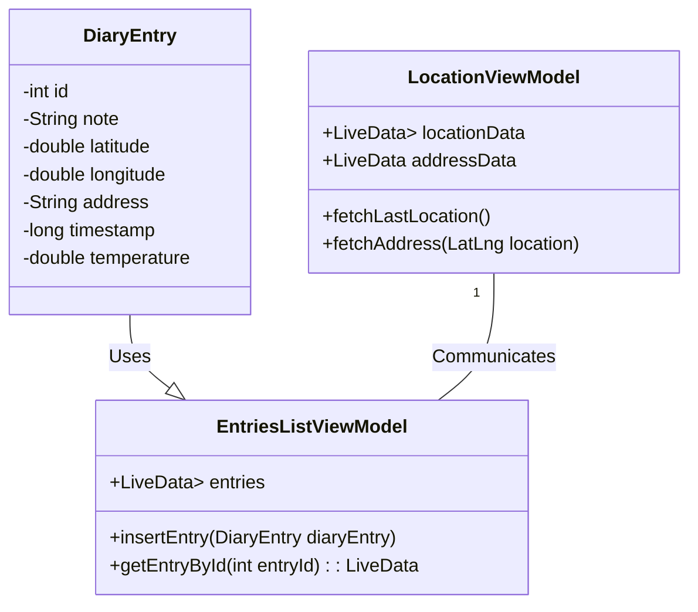
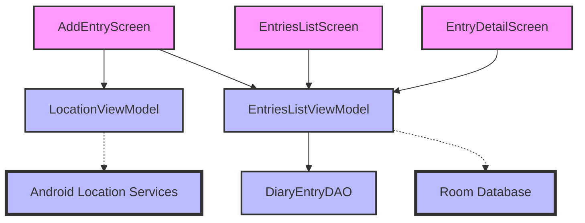

# MobileComputingProject
Project for the Mobile Computing course at University of Oulu

# Project name: Nature Diary
## Overview

Nature Diary is an Android application designed to enable users to document their experiences in nature. It utilizes Jetpack Compose for UI components and Room for data storage, providing a streamlined interface for recording observations, including location data and weather conditions.

## Features

- **Location-Based Entries**: Automatically captures the user's location for each diary entry.
- **Weather Data**: Integrates current weather data, including temperature, for the location of each entry.
- **List Previous Entries**: Allows users to list all previous entries and view them in detail.
- **Entry Details**: Users can view details of each entry, including location on a map and weather conditions at the time of the entry.
- **Adaptive UI**: Supports light and dark mode themes, adapting to the user's device settings.

## Technology Stack

- **Android Jetpack Compose**: For building the UI in a declarative and efficient way, offering a modern development experience.
- **Room Database**: For local data storage, ensuring your diary entries are safely stored and easily retrievable.
- **Hilt**: For dependency injection, simplifying the way objects are managed across the application.
- **Google Maps API**: To display the user's location on a map within diary entries.
- **Open-Meteo Weather API**: For fetching real-time weather data based on the user's location.

## UML Class Diagram for ViewModel and Entity:

## UML Component Diagram for Screens and ViewModel Communication

